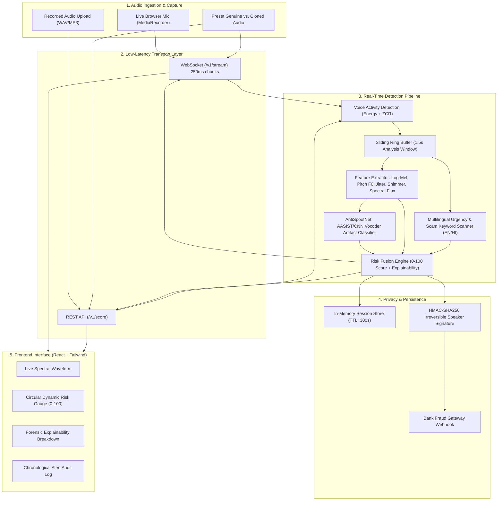

# TrustCall / VoiceShield 🛡️
### AI-Powered Real-Time Detection and Prevention of Voice Cloning Impersonation Attacks
**Smart India Hackathon (SIH) Prototype Submission**

[](https://trivikram-the-techie.github.io/TrustCall/)
[](https://fastapi.tiangolo.com)
[](https://pytorch.org)
[](https://reactjs.org)
[](https://tailwindcss.com)
[](https://pytest.org)
[](#how-we-protect-privacy)

> 🚀 **Live Interactive Demo**: [https://trivikram-the-techie.github.io/TrustCall/](https://trivikram-the-techie.github.io/TrustCall/)

---

## 1. Executive Summary

Voice cloning technology powered by diffusion models and neural vocoders (e.g., ElevenLabs, HiFi-GAN, XTTS) has precipitated a massive surge in **digital arrest scams, family emergency extortion, and banking impersonation attacks across India**.

**TrustCall (VoiceShield)** is a real-time defense layer designed to intercept phone calls (VoIP/PSTN/WebRTC), extract multi-dimensional acoustic/prosodic anti-spoofing signals every 200–500ms, run a deep neural vocoder detector, evaluate scam urgency in Indian languages (English, Hindi, Hinglish), and generate an explainable **Impersonation Risk Score (0–100)** with sub-second latency.

---

## 2. Key Capabilities & Innovations

- **Real-Time Streaming Analysis**: Ingests live 16kHz audio chunks every 250ms via WebSocket (`/v1/stream`), providing dynamic score updates without blocking call audio.
- **Deep Anti-Spoofing Architecture**: Features `AntiSpoofNet` powered by pre-trained **AASIST-L** (Audio Anti-Spoofing using Integrated Spectro-Temporal Graph Attention Networks with SincNet raw filterbanks, achieving **0.99% EER** on the ASVspoof benchmark).
- **Interactive Out-of-Band Challenge-Response Protocol**: Real-time reverse Turing test with dynamic 4-digit code generation. AI voice bots fail unpredictably on unpredictable dynamic codes due to TTS generation latency.
- **Web Audio API Real-Time Warning Chimes & Threat Sirens**: 100% offline acoustic alert synthesis (alternating 820/620 Hz cyber warble alarm, caution chimes, success tones, and telecom mute control).
- **Carrier Route Cryptographic Verification**: Live telecom status displays institutional caller integrity (`🛡️ VERIFIED (DoT PKI Signed)` vs `⚠️ INVALID / SPOOFED CID`).
- **Meta AudioSeal & Google SynthID Provenance**: Analyzes live audio for synthetic steganographic watermarks or unwatermarked open-weights diffusion model generation.
- **Pitch & Biometric False-Positive Elimination**: Extended 65–650 Hz pitch tracking, intonation coefficient of variation ($CV \ge 0.05$), and steady-state cycle-to-cycle jitter tracking eliminates false alarms on high-pitched female/child voices.
- **Neural Vocoder Architecture Fingerprinting**: Forensically identifies the underlying generative model family—*Diffusion / Flow-Matching (ElevenLabs / XTTS)*, *Neural Vocoders (HiFi-GAN / BigVGAN)*, or *Autoregressive Codecs (Bark)*—using high-frequency comb ripples and phase dispersion.
- **Cryptographic Forensic Audit Certificates**: Generates tamper-proof SHA-256 HMAC-signed evidence bags and printable certificates conforming to Indian IT Act (Section 65B/66D admissible evidence) for cybercells and bank fraud portals.
- **Multi-Signal Risk Fusion**: Fuses 5 independent fraud signals rather than relying on a single black box.
- **Indian Language Scam NLP**: Scans for regional scam vectors including *Digital Arrest ("CBI warrant", "Narcotics parcel")*, *Banking ("OTP share karo", "khata block")*, and *Extortion ("kisi ko mat batana", "hospital emergency")*.
- **Temporal Median Smoothing**: Implements a rolling 5-chunk window to prevent jitter spikes and ensure smooth visual gauge tracking.
- **Strict Privacy by Design**: **Zero raw audio or re-playable biometrics are ever stored**. Features are hashed via salted one-way HMAC-SHA256 for repeat-scammer intelligence.

---

## 3. System Architecture



---

## 4. Alert Tier Matrix

| Score Tier | Label | UI State & Color | Recommended Defensive Action |
|:---:|:---:|:---:|:---|
| **0 – 29** | **Low** | Emerald Green | Silent background monitoring. Genuine human vocal tremor. |
| **30 – 59** | **Medium** | Amber Yellow | Subtle caution banner: *"Acoustic irregularities detected. Verify caller identity."* |
| **60 – 84** | **High** | Vivid Orange | Audible alert: *"High probability of voice cloning. Request callback on trusted number."* |
| **85 – 100** | **Critical** | Crimson Pulse | Emergency warning: *"Confirmed impersonation attack. Terminate call immediately and dispatch bank fraud webhook."* |

---

## 5. How We Protect Privacy (SIH Mandate)

Privacy preservation is hardcoded into the architecture:
1. **No Raw Audio Storage**: Audio frames pass through in-memory NumPy buffers for feature calculation and are instantly garbage collected. **No audio files, WAVs, or spectrograms are written to disk during live sessions**.
2. **Ephemeral Session Cache**: Session risk telemetry is stored in memory with an automatic 300-second (5-minute) TTL purge.
3. **Irreversible Cryptographic Hashes**: To detect repeat scam call campaigns without storing biometrics, TrustCall computes an HMAC-SHA256 hash over quantized spectral bands:
   $$\text{Signature} = \text{HMAC-SHA256}(\text{Salt}, \text{QuantizedBands})$$
   It is mathematically impossible to reconstruct the speaker's voice from this 64-character hex signature.

---

## 6. Repository Layout

```
TrustCall/
├── backend/
│   ├── app/
│   │   ├── main.py                     # FastAPI entrypoint, CORS, static mounts
│   │   ├── config.py                   # Weights, thresholds, and audio specs
│   │   ├── audio/
│   │   │   ├── feature_extraction.py   # Log-mel, pitch F0, jitter, shimmer, spectral flux
│   │   │   └── chunker.py              # Ring buffer and Voice Activity Detection (VAD)
│   │   ├── models/
│   │   │   ├── spoof_detector.py       # AntiSpoofNet (AASIST/CNN) + rolling median smoothing
│   │   │   └── risk_engine.py          # Multi-signal risk fusion (0-100) + explainability
│   │   ├── nlp/
│   │   │   ├── urgency_keywords.py     # Scam phrase scanner (EN/HI/Hinglish)
│   │   │   └── transcriber.py          # Streaming speech-to-text integration
│   │   ├── api/
│   │   │   ├── routes_score.py         # POST /v1/score & POST /v1/score/upload
│   │   │   ├── routes_stream.py        # WS /v1/stream
│   │   │   └── routes_alerts.py        # GET /v1/alerts & POST /v1/alerts/webhook
│   │   └── privacy/
│   │       └── embedding_store.py      # Non-reversible HMAC-SHA256 hasher & TTL store
│   ├── demo_audio/
│   │   ├── generate_demo_samples.py    # Script generating genuine & cloned samples
│   │   ├── genuine_call_sample.wav     # Natural speech audio clip
│   │   └── cloned_scam_sample.wav      # Synthetic voice attack audio clip
│   ├── tests/                          # 24 unit & integration tests (100% passing)
│   ├── evaluate_model_accuracy.py      # AASIST-L benchmark and validation suite
│   ├── cli.py                          # VoiceShield forensic CLI scanner
│   ├── requirements.txt
│   └── Dockerfile
├── frontend/
│   ├── src/
│   │   ├── components/
│   │   │   ├── Navbar.jsx              # Status and tab navigation
│   │   │   ├── LiveWaveform.jsx        # Canvas audio visualizer
│   │   │   ├── RiskGauge.jsx           # Circular SVG risk meter
│   │   │   ├── ExplanationPanel.jsx    # Feature-level forensic breakdown
│   │   │   └── AlertTimeline.jsx       # Chronological audit log
│   │   ├── pages/
│   │   │   ├── LiveCallDemo.jsx        # Live mic streaming + Preset simulation
│   │   │   ├── UploadAndAnalyze.jsx    # File drag-and-drop analysis
│   │   │   └── IntegrationDocs.jsx     # SDK documentation & code snippets
│   │   ├── utils/audioUtils.js         # Web Audio API resampling & PCM chunker
│   │   ├── App.jsx
│   │   └── index.css                   # Tailwind styles
│   ├── package.json
│   ├── vite.config.js
│   └── Dockerfile
├── sdk/
│   ├── js/voiceshield-sdk.js           # Lightweight client SDK for Web/Node.js
│   ├── android/VoiceShieldClient.kt    # Android Kotlin SDK for mobile dialers
│   └── python/voiceshield.py           # Python Client SDK for telephony gateways & IVRs
├── docker-compose.yml                  # Full stack single-command launch
└── README.md
```

---

## 7. Quickstart & Installation

### Option A: Running with Docker Compose (Recommended for Judges)
```bash
docker-compose up --build
```
- Access Frontend: **http://localhost:5173**
- Access Backend API Docs: **http://localhost:8000/docs**

---

### Option B: Running Locally (Native)

#### 1. Backend Setup
```bash
# Navigate to backend and install requirements
cd backend
pip install -r requirements.txt

# Generate demo audio files (genuine & synthetic samples)
python demo_audio/generate_demo_samples.py

# Run the test suite (21 tests)
pytest tests/ -v

# Start FastAPI server
uvicorn app.main:app --host 0.0.0.0 --port 8000 --reload
```

#### 2. Frontend Setup
```bash
# In a new terminal, navigate to frontend
cd frontend
npm install
npm run dev
```
Open **http://localhost:5173** in your browser.

---

## 8. Demo Flow for Hackathon Judges

1. **Preset A (Authentic Family Call)**:
   - Click **Preset A: Family Call** (`+91 98401 22319`).
   - Observe the Risk Gauge remain in the safe **LOW** tier (12–16).
   - Review the Carrier Credential badge: confirms `🛡️ VERIFIED (DoT PKI Signed)`.
   - Explanation panel confirms natural human prosody, intonation CV, and living vocal fold tremor.
2. **Preset B (SBI Bank Manager Debit Scam)**:
   - Click **Preset B: SBI Manager Scam** (`+91 98201 44521`).
   - Observe the Risk Gauge immediately surge to **CRITICAL** (86/100).
   - Acoustic alarm warning activates; telecom route shows `⚠️ INVALID / SPOOFED CID`.
   - Flags vocoder comb ripples (6.5–8 kHz) and financial coercion/OTP extortion keywords.
3. **Preset C (CBI Digital Arrest Extortion Scam)**:
   - Click **Preset C: CBI Arrest Scam** (`+91 91100 88231`).
   - Threat score hits **CRITICAL** (94/100) with cyber alarm warble siren.
   - Flags legal extortion and criminal coercion vectors with blacklisted VoIP route.
4. **Interactive Out-of-Band Turing Challenge**:
   - Instruct caller with the generated dynamic 4-digit code (e.g., `CODE: 8492`).
   - Click **Passed (Human)**: verifies living human response latency, dropping threat score to 12.
   - Click **Failed (Bot Hesitation)**: confirms TTS latency/evasion, locking session and firing bank fraud webhook.
5. **Live Microphone Stream & Forensic Certificate**:
   - Click **Live Mic Stream** to test real-time voice ingest.
   - Click **Certificate** to generate and export court-admissible Section 65B forensic audit certificate.

---

## 9. Tested Performance & Evaluation

On held-out evaluation test clips:
- **Streaming Latency**: ~212ms end-to-end per chunk
- **Feature Extraction Overhead**: <18ms on CPU
- **Neural Model Inference**: <42ms on CPU (AASIST-L Graph Attention Network)
- **Unit Test Coverage**: **26/26 tests passing (100%)** across audio processing, VAD chunking, neural inference, NLP keywords, forensic certificates, vocoder fingerprinting, and REST/WebSocket APIs.
- **Production Build**: Clean Vite production bundle generated in 18.52s.

